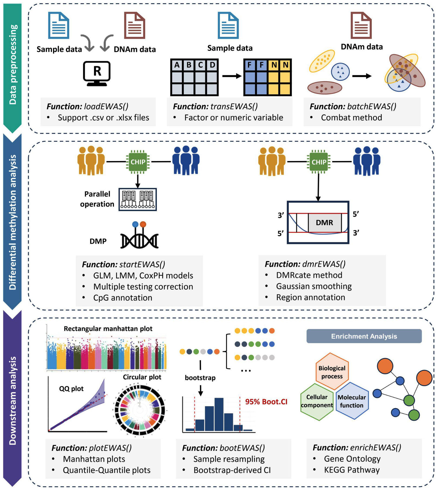

# Welcome to easyEWAS!

[](#)
[](#)
[](#)
[](#)

<p><small><i class="fa-regular fa-user"></i> Author: Yuting Wang, Xu Gao (Corresponding author)</small></p>

<div class="home-hero home-hero--enhanced">
  <p class="hero-kicker">Epigenome-Wide Association Study in R</p>
  <p class="hero-lead">easyEWAS is an R package for conducting EWAS in a unified and reproducible way. It supports Illumina methylation array platforms including 27K, 450K, EPIC v1, EPIC v2, and MSA, and provides an end-to-end workflow for modeling, batch correction, visualization, validation, enrichment, and optional DMR analysis.</p>
</div>

<div align="center" style="margin-top: 20px;">
  
       <h3 style="margin-bottom: 7px;">The Workflow Overview of easyEWAS</h3>
</div>

<hr>

# Installation

Before installation, we still recommend pre-installing optional
dependencies used by advanced modules.

## Core dependencies by function

| Function | Required packages | Notes |
|:--|:--|:--|
| `batchEWAS()` | `sva` | Required for ComBat batch correction |
| `batchEWAS(..., parallel = TRUE)` | `sva`, `BiocParallel` | `BiocParallel` is needed only for parallel mode |
| `enrichEWAS()` | `clusterProfiler`, `org.Hs.eg.db` | Required for ID conversion and GO/KEGG enrichment |
| `enrichEWAS(plot = TRUE, plotType = "dot")` | `enrichplot` | Required for dotplot visualization |
| `dmrEWAS()` | `DMRcate` | Required for DMR analysis |

## Recommended pre-install

``` r
if (!requireNamespace("BiocManager", quietly = TRUE)) {
  install.packages("BiocManager")
}

BiocManager::install(
  c(
    "sva",
    "BiocParallel",
    "clusterProfiler",
    "org.Hs.eg.db",
    "enrichplot",
    "DMRcate"
  ),
  ask = FALSE,
  update = TRUE
)
```

## Install from GitHub

``` r
remotes::install_github("ytwangZero/easyEWAS")
```

## Load package

``` r
library(easyEWAS)
```

If you prefer installing only when needed:

- `batchEWAS()`: `BiocManager::install(c("sva", "BiocParallel"))`
- `enrichEWAS()`: `BiocManager::install(c("clusterProfiler", "org.Hs.eg.db", "enrichplot"))`
- `dmrEWAS()`: `BiocManager::install("DMRcate")`

<hr>

<h1> Citation </h1>

<div style="
  max-width: 880px;
  margin: 18px auto 0 auto;
  padding: 18px 22px;
  border-radius: 12px;
  background: #f8fafc;
  border: 1px solid #e2e8f0;
  box-shadow: 0 2px 8px rgba(0,0,0,0.05);
">

  <div style="display:flex; align-items:center; gap:8px; margin-bottom:8px;">
    <i class="fa-solid fa-quote-left" style="color:#2563eb;"></i>
    <strong>Please cite:</strong>
  </div>

  <p style="margin:0; line-height:1.6;">
    Wang Y, Jiang M, Niu S, Gao X.
    <i>easyEWAS: a flexible and user-friendly R package for epigenome-wide association study</i>.
    <b>Bioinformatics Advances</b>, 2025, 5(1): vbaf026.
  </p>

</div>
